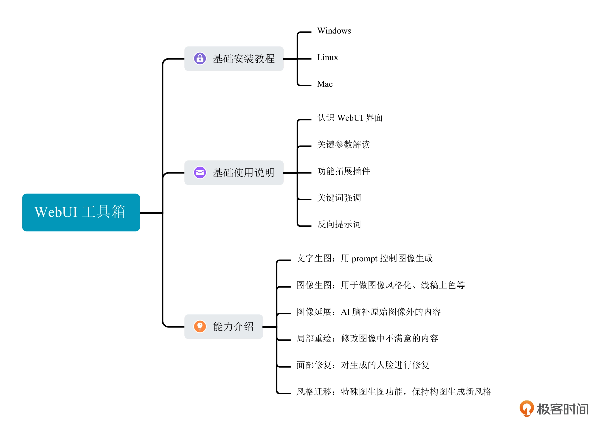

# AI绘画核心技术与实战

## 开篇词｜AI技术爆发，如何实现绘画模型自由？

+ 图像风格化
+ 图像生成
+ 数字人 
+ 等

多模态大模型
传统深度学习方法与 AI 新技术中间有很大的只是鸿沟？ ---- 什么区别？ 
超参数？ 
扩散模型？ 


## 先导篇｜先睹为快，AI绘画作品集

+ LensaAI 创意头像生成
+ Midjourney AI 绘画效果
+ Adobe Firefly AI 修图能力


### 图像类技能

+ 创意图像生成： 输入 prompt，得到对应的图像效果 - 拼想象力
  + 国风人像
  + 可爱萌宠
    + 
  + 魔法精灵
    + 
  + 盲盒手办
  + 写意山水
  + 室内设计
  + 精致景色
  + 二次元形象
  + 等
+ 漫画 IP 形象
  + 融合 IP
    + 
  + 创建 IP 
+ 线稿上色
  + 
+ 图像风格化：将照片转换成卡通风格，油画风格，水彩风格等
  + 
+ 创意头像 （LensaAI）
+ 老照片修复
+ 智能修图
+ 等

### 视频类技能

+ 视频风格化
+ 视频生成
  + Meta 提出的 Make-a-video 技术、
  + runway 提出的 Gen-2 技术、
  + 英伟达的 Video LDM 技术
  
### 更多有趣技能

+ 创意广告
+ 图像变体
+ 制作贴纸
+ 杂志封面生成
+ 二维码生成等

## 01｜WebUI：免费AI绘画工具箱的N大绘图功能



## 02｜Prompt使用技巧：如何更精准地控制绘画风格和内容？

## 03｜进阶应用：图生图技巧与创作社区初探

## 04｜实战项目（一）：用LoRA制作一个你自己的漫画故事

## 05｜ 旧画师GAN：天生有缺陷还是学艺不精湛？

GAN： 生成对抗网络

+ 变小孩
+ 变老
+ 性别变换

```md
故事还要从“遥远”的 2014 年说起。那时候，Ian Goodfellow 等人提出了生成对抗网络——也就是 GAN 这个全新的概念。当时的深度神经网络通常需要收集图像样本和目标标签，比如分类任务的标签就是类别信息、年龄回归任务的标签就是年龄数值。通常通过交叉熵损失来训练分类任务，通过数值误差损失（比如 L1 损失和 L2 损失）来训练回归任务。而 GAN 的思路则完全不同。GAN 模型由两个模块构成，也就是常说的生成器（Generator）和判别器（Discriminator）。可以这样类比，生成器是一位名画伪造家，目标是创作出逼真的艺术品，判别器是一位艺术鉴赏家，目标是从细节中找出伪造破绽。生成器与判别器在模型训练的过程中持续更新与对抗，最终达到平衡。
```

