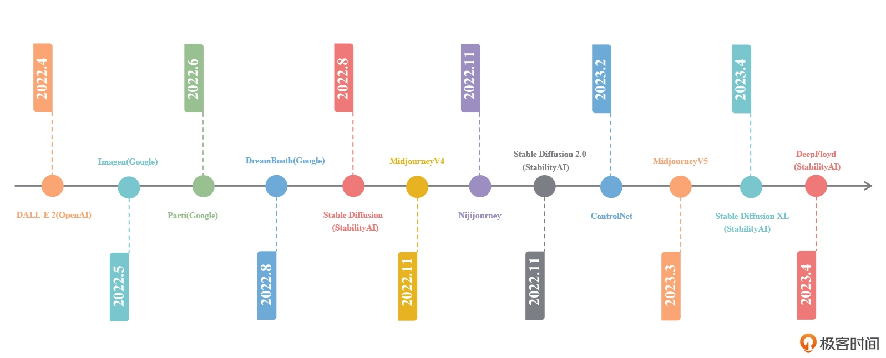

# AI绘画核心技术与实战

## 开篇词｜AI技术爆发，如何实现绘画模型自由？

+ 图像风格化
+ 图像生成
+ 数字人 
+ 等

多模态大模型
传统深度学习方法与 AI 新技术中间有很大的只是鸿沟？ ---- 什么区别？ 
超参数？ 
扩散模型？ 

## 先导篇｜先睹为快，AI绘画作品集

+ LensaAI 创意头像生成
+ Midjourney AI 绘画效果
+ Adobe Firefly AI 修图能力

### 图像类技能

+ 创意图像生成： 输入 prompt，得到对应的图像效果 - 拼想象力
  + 国风人像
  + 可爱萌宠
    + 
  + 魔法精灵
    + 
  + 盲盒手办
  + 写意山水
  + 室内设计
  + 精致景色
  + 二次元形象
  + 等
+ 漫画 IP 形象
  + 融合 IP
    + 
  + 创建 IP 
+ 线稿上色
  + 
+ 图像风格化：将照片转换成卡通风格，油画风格，水彩风格等
  + 
+ 创意头像 （LensaAI）
+ 老照片修复
+ 智能修图
+ 等

### 视频类技能

+ 视频风格化
+ 视频生成
  + Meta 提出的 Make-a-video 技术、
  + runway 提出的 Gen-2 技术、
  + 英伟达的 Video LDM 技术
  
### 更多有趣技能

+ 创意广告
+ 图像变体
+ 制作贴纸
+ 杂志封面生成
+ 二维码生成等