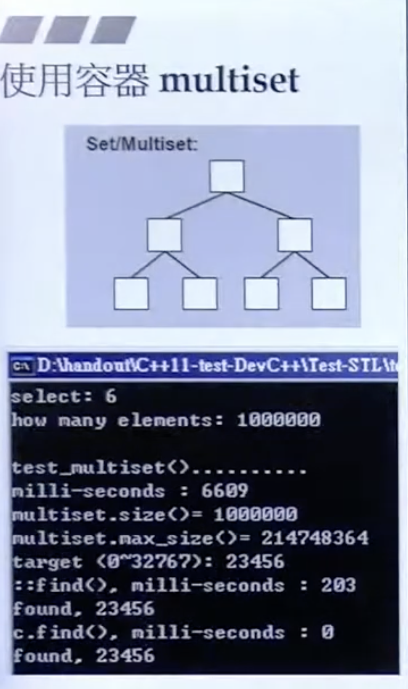

## 六大部件

+ 容器（Containers）
+ 迭代器（Iterators）
+ 分配器（Allocators）
+ 算法（Algorithms）
+ 适配器(Adapters)
+ 仿函数（Functors）

Iterator 是一个泛化的指针，可以使用指针的对应操作

## range-based for statement

```c++
for( auto elem : vec ) {}

for( auto& elem : vec ) {}
```

## 容器（Containers）

+ 序列式容器（Sequence Containers）
+ 关联式容器（Associative Containers）


### 数组（Array）


### Vector

内存中，地址可以扩展，两倍扩展

+ size()
+ front()
+ back()
+ data()
+ capacity()


其中 `size()` 是通过函数 `end() - begin()` 来进行实现的


其中的 `insert_aux()` 会被其他的调用，因此其中会有各种的判断


### list

双向链表

+ size()
+ max_size()
+ front()
+ back() 

标准库有一个 sort, 容器中也有个 sort


### forward_list 

单向链表
单项链表是插入在前面还是在后面?


### deque 
两边都可以扩充


### Stack 

Containers adpator 

没有提供 Iterator

先进后出 

### queue

Containers adpator  

没有提供 Iterator

先进先出

### 关联式容器 multiset 

红黑树形成的结构



### 关联式容器 multimap


如何使用的操作

### 关联式容器 unordered_multiset

hashTable 结构


### set 
### map
### unordered_set 
### unordered_map


## 分配器 Allocator


 