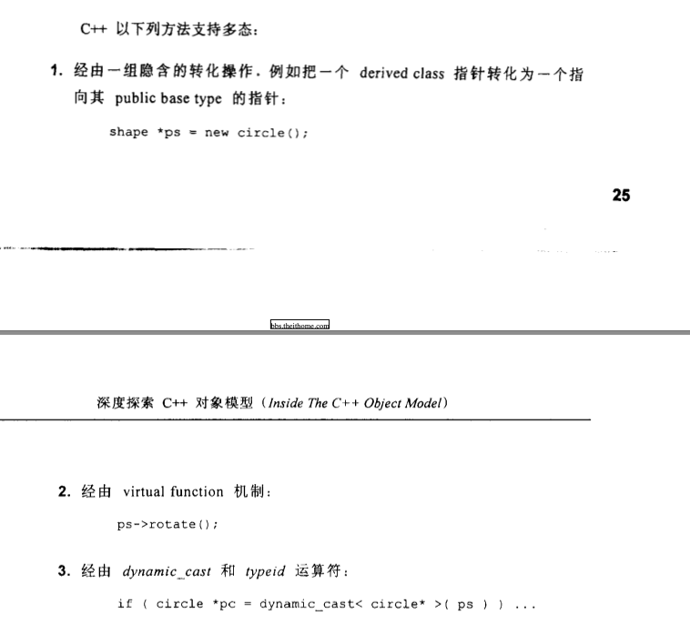

# 深度探索 C++ 对象模型读书笔记

## 第一章 关于对象

**名词:**
 + ADT: 抽象数据类型（abstract data type）


1. 每一个 non-inline member function 只会产生一个函数实体；
2. 每一个“拥有零个或一个定义”的 inline function 则会在其每一个使用者（模块）身上产生一个函数实体.


C++ 在布局以及存取时间上主要的额外负担是由 virtual 引起的，包括：

+ **virtual function 机制**用以支持一个有效率的 “执行期绑定”（runtime binding）
+  **virtual base class** 用以实现 “多次出现在继承体系中的 Base class, 有一个单衣而被共享的实体


### 1.1 C++ 对象模式（The C++ Object Model）

class data members(两种): static 和 nonstatic 
class member functions(三种)：static、nonstatic 和 virtual


+ nonstatic data member 被配置于每一个 class object 内；
+ static data member 被存放在所有的 class object 之外;

+ static 和 nonstatic function members 被放在所有的 class object 之外
+ **Virtual functions** 则以两个步骤支持:
	1. 每一个 class 产生一个虚表 virtual table（vtbl）, 虚表中保存指向 virtual function 的指针；
	2. 每一个 class object 被添加一个指针，指向虚表；
	   虚表的设定与重置由类的**构造函数**、**析构函数**和**copy assignment**运算符自动运行;
	   虚表第一个 slot 一般指向的是每一个关联的 type_info object(用以支持 runtime type identification, RTTI)

	


### 1.3 对象的差异（An Object Distinction）

C++ 一般有三种编程范式（书中称为 programming paradigms, 程序设计典范）

+ 面向过程（程序模型，procedural model）
+ 抽象数据类型（abstract data type mode, ADT）：抽象数据类型是一个数学模型，定义了一组数据及其操作，而不关心具体实现。它强调数据以及与之相关的操作，但不涉及实现细节
+ 面向对象模型（object-oriented model）： 面向对象模型典型特征是封装、继承与多态，例如 Bear 继承自 Anima


C++中的多态需要通过**指针（pointers）** 或 **引用（references）** 操作才能完成

C++多态有两种办法

1. 使用指针或者引用，再配合虚函数的调用, 二者必须符合才行；
2. 经由 dynamic_cast 和 typeid 运算符;



> 树上说明需要三种方法，但是实际上只有两种，单纯的指针操作并不会操作多态，必须由指针或者引用 + 虚函数才行，普通函数不会触发多态性质


class object 所需要内存大小依赖于：

1. nonstatic data member 的总和大小；
2. 由于 alignment 的需求而填补（padding）上去的空间；
3. 为了支持 virtual 而由内部产生的任何额外负担；

## 第 2 章 构造函数语意学（The Semantics of Contructors）


### 2.1 Default Constructor 的构建操作

如果一个类没有构造函数，那么编辑器会在适当的时候合成一个默认的构造函数，但是这个构造函数一般是 trivial（浅薄而无能，没啥用）的，它不会去做一些**程序需要**的事情

一下的四种情况讨论编辑器合成的构造函数 "nontrivial"


### case 1: 带有 Default Constructor 的 Member class Object

一个 class 没有构造函数，但是该类里面包含一个带有构造函数类

```C++

class Foo {
public:
	Foo();
	Foo(int);
};

class Bar {
public:
	Foo foo;
	char *str; //合成的默认构造函数并不会将 str 置空
};


```
在上面代码中， 类 Foo 作为 类 Bar 的一个成员变量，类 Foo 有默认构造函数，因此编译器会为 Bar 合成一个默认的构造函数，会去调用 类 Foo 的默认构造函数， 类似于下面

```C++

// 合成一个默认构造函数，将成员变量的 foo 进行初始化，但不会去初始化 Bar::str 
inline Bar::Bar() { 

	// 伪代码
	foo.Foo::Foo(); 
}

```

如果类 Bar 存在默认构造函数（一个或者多个），那么编译器会对 Bar 的每一个默认构造函数进行扩张，调用每一个 Member class 的构造函数


### case 2： 带有 Default  Constructor 的 Base class 

如果子类（Derived class）没有默认构造函数，但是父类（Base class） 有默认构造函数，那么子类默认构造函数会被合成出来，调用父类的默认构造函数


如果子类有多个构造函数，但没有 default constructor, 编译器会扩张现有的每一个 constructors, 将用以调用父类的默认构造函数，此时并不会去合成一个 default constructor（用户已经定义了）


### case 3： 带有一个 Virtual Function 的 class

一下两种情况需要合成 default  constructor

1. class 声明（或继承）一个 virtual function
2. class 派生自一个继承串链，其中有一个或更多的 virtual base classes;

编译器需要在编译期间构建**虚函数表**以及**虚表指针**，编译器需要再构造期间创建虚表以及虚表指针

```c++
class Widget {
public:
	virtual void flip() = 0;
};

class Bell: public Widget {
public:
	void flip() override  { }
};

class Whistel: public Widget {
public:
	void flip() override  { }
};

void flip(const Widget& widget) { widget.flip(); } // 此处引发虚函数调用，需要进行动态调用


```

### case 4: 带有一个 Virtual Base class 的 class

```c++
class X { public: int i;};
class A : public virtual X { public: int j;};
class B : public virtual X { public: int d;};
class C : public A, public B { public: int k;};

```

## 2.2 Copy Constructor 的构建操作

有三种情况

+ 赋值运算 ` X x; X xx = x;`
+ 函数调用 Object 当做参数；
+ 函数返回 Object 对象；


编译器会在必要的时候合成拷贝构造函数，它的操作是将非 object 成员变量一个个的复制过去，对于Object，将会调用 Object 的 copy constructor;

```c++
class X {
public: 
	X(const X& x);
	int i;
};

```

## 第 3 章 Data 语意学


## 疑问：

### Q1: C++ 类中的虚函数有虚表指向，类对象有一个虚指针指向虚表，那么对于 static 和 nontatic function members，类或者类对象是如何调用的？ 

**非静态成员函数**
非静态成员函数与类的对象绑定，需要通过对象调用，或者通过对象指针/引用调用。它们依赖于类实例（对象）的 this 指针。具体调用过程如下：

**调用机制**：
1. 每个非静态成员函数隐式接收一个参数，即当前对象的地址（this 指针）。
2. 编译器会在调用非静态成员函数时，传递当前对象的地址给函数，以便函数可以访问对象的成员变量和其他非静态成员函数。


**对虚函数的调用**：
**虚函数表 (vtable)**：
1. 每个包含虚函数的类会有一张虚表，记录所有虚函数的地址。
2. 每个具体的对象实例会有一个指向虚表的指针，称为 虚指针 (vptr)。
3. 调用虚函数时，编译器通过 vptr 查找虚表中的函数地址，并调用相应的函数，实现动态绑定。

**静态成员函数**

静态成员函数不依赖于类的具体实例，因此：

1. 没有 this 指针。
2. 无法访问类的非静态成员变量或函数，除非通过对象实例显式传递。
3. 静态成员函数与类关联，而非具体对象。它们的调用完全是编译时静态绑定的。

**调用机制**
1. 静态成员函数的调用无需依赖对象，编译器直接根据函数名和类名查找对应的函数地址并调用。
2. 它与普通的全局函数类似，只是多了类名作用域限制。


### C++ 的虚继承怎么使用，以及有什么用


