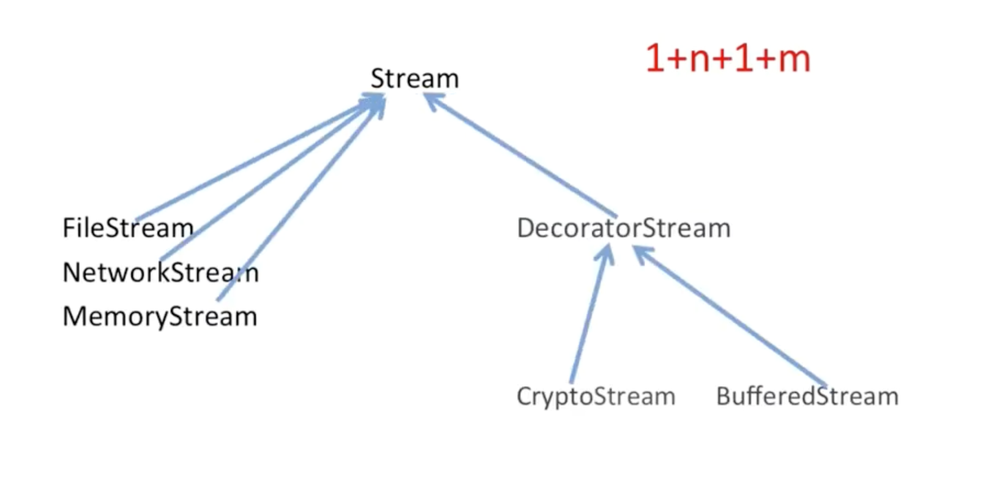

# Decorator 

## 动机

+ 在某些情况下我们可能会“过度地使用继承来扩展对象的功能”。由于继承为类型引入的静态特质，使得这种扩展方式缺乏灵活性；并且随着子类的增多（扩展功能的增多），各种子类的组合（扩展功能的组合）会导致更多子类的膨胀。

+ 如何是“对象功能的扩展”能够根据需要来动态地实现？ 同时避免“扩展功能的增多”带来的子类膨胀问题？ 从而使得任何功能扩展变化所导致的影响降为最低？ 

```c++

class Stream {
public:
    virtual char Read(int number) = 0;
    virtual void Seek(int position) = 0;
    virtual void Write(char data) = 0;

    virtual ~Stream() {}
};

class FileStream: public Stream {
public:
    virtual char Read(int number) {}
    virtual void Seek(int position) {}
    virtual void Write(char data) {}
};

class NetWorkStream: public Stream {
public:
    virtual char Read(int number) {}
    virtual void Seek(int position) {}
    virtual void Write(char data) {}
};

class MemoryStream: public Stream {
public:
    virtual char Read(int number) {}
    virtual void Seek(int position) {}
    virtual void Write(char data) {}
};

class CyptoFileStream: public FileStream {
    virtual char Read(int number) 
        FileStream::Read(number);
    }
    virtual void Seek(int position) {
        FileStream::Seek(position);
    }
    virtual void Write(char data) {
        FileStream::Write(data);
    }
}

class CyptoNetworkStream: public NetWorkStream {
    virtual char Read(int number) 
        FileStream::Read(number);
    }
    virtual void Seek(int position) {
        FileStream::Seek(position);
    }
    virtual void Write(char data) {
        FileStream::Write(data);
    }
}

class CyptoMemoryStream: public MemoryStream {
    virtual char Read(int number) 
        FileStream::Read(number);
    }
    virtual void Seek(int position) {
        FileStream::Seek(position);
    }
    virtual void Write(char data) {
        FileStream::Write(data);
    }
}
......

```
容易会出现下面的这种问题


使用组合的方式重构上面代码

```c++

// Step1: Stream 
// class CyptoFileStream: public Stream  {
//     Stream *stream; // new FileStream
//     virtual char Read(int number) 
//         stream->Read(number);
//     }
//     virtual void Seek(int position) {
//         stream->Seek(position);
//     }
//     virtual void Write(char data) {
//         stream->Write(data);
//     }
// }

// class CyptoNetworkStream: public Stream  {
//     Stream *stream; // new NetWorkStream
//     virtual char Read(int number) 
//         stream->Read(number);
//     }
//     virtual void Seek(int position) {
//         stream->Seek(position);
//     }
//     virtual void Write(char data) {
//         stream->Write(data);
//     }
// }

// class CyptoMemoryStream: public Stream {
//     Stream *stream; // new MemoryStream

//     virtual char Read(int number) 
//         stream->Read(number);
//     }
//     virtual void Seek(int position) {
//         stream->Seek(position);
//     }
//     virtual void Write(char data) {
//         stream->Write(data);
//     }
// }


// Step2 组合替代继承
class CyptoStream: public Stream {
    Stream *stream; // new MemoryStream

public:
    CyptoStream(Stream *stm): stream(stm) {}

    virtual char Read(int number) 
        stream->Read(number);
    }
    virtual void Seek(int position) {
        stream->Seek(position);
    }
    virtual void Write(char data) {
        stream->Write(data);
    }
};

class BufferStream: public Stream {
    Stream *stream; // new MemoryStream

public:
    BufferStream(Stream *stm): stream(stm) {}

    virtual char Read(int number) 
        stream->Read(number);
    }
    virtual void Seek(int position) {
        stream->Seek(position);
    }
    virtual void Write(char data) {
        stream->Write(data);
    }
};

// Step3 Decorator 

class DecoratorStream: public Stream {
protected:
    Stream *stream;
    DecoratorStream(Stream *stm): stream(stm) {

    }
};

class CyptoStream: public DecoratorStream {
public:
    CyptoStream(Stream *stm): DecoratorStream(stm) {}

    virtual char Read(int number) 
        stream->Read(number);
    }
    virtual void Seek(int position) {
        stream->Seek(position);
    }
    virtual void Write(char data) {
        stream->Write(data);
    }
};

class BufferStream: public DecoratorStream {

public:
    BufferStream(Stream *stm): DecoratorStream(stm) {}

    virtual char Read(int number) 
        stream->Read(number);
    }
    virtual void Seek(int position) {
        stream->Seek(position);
    }
    virtual void Write(char data) {
        stream->Write(data);
    }
};

```



## 模式定义

动态（组合）地给一个对象增加一些额外的职责，就增加功能而言，Decorator模式比生成子类（继承）更为灵活（消除重复代码 && 减少子类个数）。

## 结构


## 要点总结

+ 通过采用组合而非继承的手法，Decorator 模式实现了在运行时动态扩展对象功能的能力，而且可以根据需要扩展多个功能。避免了使用继承带来的“灵活性差”和“多子类衍生问题”。

+ Decorator 类在接口上表现为 is-a Component 的继承关系，即 Decorator 类继承了 Component 类所具有的所有接口，但在实现上又表现为 has-a Component 的组合关系，即 Decorator 类又实用了另外一个 Component 类。

+ Decorator 模式的目的并非解决“多子类衍生的多继承”问题， Decorator模式应用的要点在于解决"主体类在多个方向上的扩展功能" -- 是为了 ”装饰“含义。

