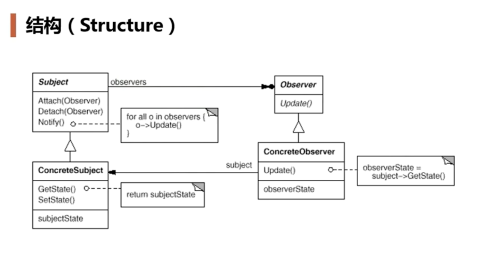

# 观察者模式（Observer）

+ 在软件构建过程中，我们需要为某些对象建立一种”通知依赖关系“ -- 一个对象（目标对象）的状态发生改变，所有的依赖对象（观察者对象）都将得到通知。如果这样的依赖关系过于紧密，将是软件不能很好地抵御变化

+ 使用面向对象技术，可以将这种依赖关系弱化，并行程一种稳定的依赖关系，从而实现软件体系结构的松耦合

```c++

class MainForm: public Form 
{
    TextBox* txtFilePath;
    TextBox* txtFileNumber;

    ProgressBar* progreeBar; // 使用 Bar 来看进度条

public:
    void Button1_Click() {
        string filePath = txtFilePath->getText();
        int number = atoi(txtFileNumber->getText().c_str());

        FileSplitter splitter(filePath, number, progressBar ); // 传输到 FileSplitter 里面
        splitter.split();
    }
};

class FileSplitter 
{
ProgressBar* m_progressBar;

public:
    FileSplitter(const string filePath, int number, ProgressBar *progressBar)
    ....
    void split() {
        for (int i =0; i < m_fileNumber; i++) {
            ...
            if (m_progressBar != nullptr) {
                m_progressBar->setValue((i+1)/m_fileNumber); // 依赖倒置原则
            }
        }
    }

}

```
这样做法违背了依赖倒置问题，高层模块（FileSplitter）不应该依赖于底层模块（ProgressBar）

下面是改良后的状态，针对单个通知

```c++

class IProgress
{
    virtual void DoProgress(float progress) = 0;
    virtual ~IProgress() = 0;
};

class MainForm: public Form, public IProgress {
    ProgressBar* progreeBar; // 使用 Bar 来看进度条

    virtual void DoProgress(float value) {
        progressBar->setValue(value);
    }
};

class FileSplitter {
    IProgress* m_progress;

    void split() {
        for (int i =0; i < m_fileNumber; i++) {
            ...
            if (m_progressBar != nullptr) {
                m_progressBar->DoProgress((float)(i+1)/m_fileNumber);
            }
        }
    }
}

```

但是上面存在一个问题，仅仅能指向一个通知对象，无法添加观察者。

## 模式定义

定义对象间的一种一对多（变化）的依赖关系，以便当一个对象（Subject）的状态发生改变时，所有依赖于它的对象有得到通知并自动更新。

## 结构




## 要点总结

+ 使用面向对象的抽象，Observer 模式使得我们可以队里地改变目标与观察者，从而使二者之间的依赖关系达致松耦合；
+ 目标发送通知时，无需指定观察者，通知（可以携带通知信息作为参数）会自动传播；
+ 观察者自己决定是否需要订阅通知，目标对象对此一无所知；
+ Observer 模式是基于事件的UI框架中非常常用的设计模式， 也是 MVC 中常用的一种模式；

