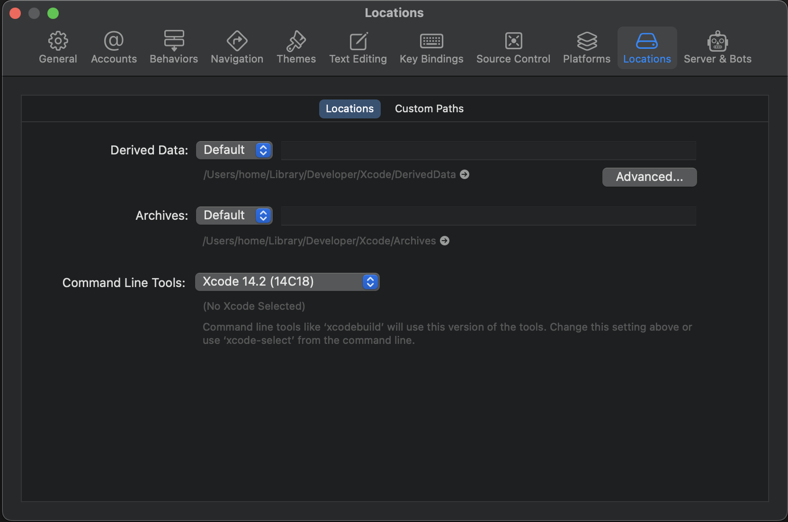
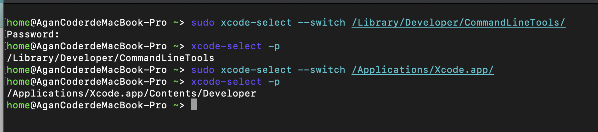
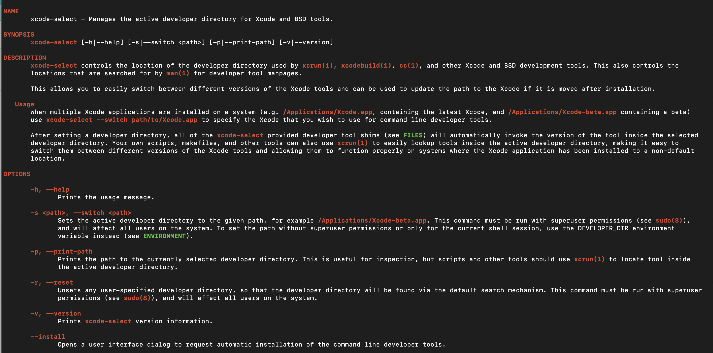

# xcode-select、xcrun、以及 xcodeBuild 理解与实战

标签： iOS macOS

---

[TOC]

在开篇之前，需要先明确以下几点：

+ Xcode 仅仅是一个可视化编辑器，Xcode 执行的 Build、Run、Archive、Export 等大部分操作（Xcode功能非常复杂，没有尝试所有功能）最终是通过命令或者命令的组合来实现的。

+ Xcode 管理好多个 Platform， Xcode 集成了对应 Platforms 的 SDKs 以及对应的工具，可以通过 `xcodebuild -showsdks` 来查看对应的内容, 这也就是 Xcode 包越来越大原因。

明确上面几点后，考虑如下问题:

+ 切换 Xcode 本质以及如何切换 Xcode？
+ Xcode 如何管理不同的 Platform（macosx、iphoneos、iphonesimulator等）？
+ 如何使用 command line tool 进行编译打包？

## 切换 Xcode 本质以及如何切换 Xcode？

首先，我们来说明下如何切换 Xcode， 可以通过如下两种方式进行：

1. Xcode 设置中更改不同版本: Xcode -> Settings -> Locations -> Command Line Tool ;
    

2. 命令行指令 xcode-select: `sudo xcode-select --switch <path>`
    

实际上，在可视化 Xcode 设置里面执行方式 1 切换最终还是使用方式 2 来执行的。


`xcode-select` 是系统预定义在 `/usr/bin/xcode-select`下， 通过 `man xcode-select` 看到对应介绍

> xcode-select - Manages the active developer directory for Xcode and BSD tools.
>
>  xcode-select controls the location of the developer directory used by xcrun(1), xcodebuild(1), cc(1), and other Xcode and BSD development tools. This also controls the locations that are searched for by man(1) for developer tool manpages.

`xcode-select` 本质是管理 Xcode 和 BSD 工具开发者目录（active developer directory）。切换 Xcode 其实也就是切换开发者目录（active developer directory）。切换到不同目录就是为了使用该目录下面的工具、SDKs 等。



## Xcode 如何管理不同的 Platform（macosx、iphoneos、iphonesimulator等）？

`xcode-select` 来管理不同开发者目录，然而在同一个目录下，会存在多平台，每个平台的特殊性使得该平台有不一样的 sdk 和对应的工具。好在系统给开发者提供 `xcrun` 来管理，通过参数 `--sdk` 告诉 `xcrun` 在哪一个平台（Platform）找对应的 开发者工具。默认 sdk 为 macosx。

```shell

#  查找默认 macosx 下面的工具 simctl
xcrun -f simctl

# 查找 iphoneos 下面的工具 traitsutil
xcrun --sdk iphoneos -f traitsutil

```

## 如何使用 command line tool 进行编译打包？

